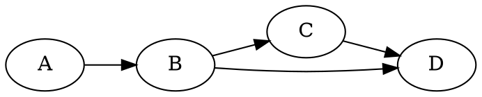

# 🚀 快速启动指南 - 测试导出功能

## 方法 1：独立测试页面（最快）

无需安装依赖，直接在浏览器中测试：

```bash
# 在浏览器中打开测试页面
open test-export.html
# 或者
firefox test-export.html
# 或者
google-chrome test-export.html
```

**测试内容：**
- ✅ 简单 SVG 图形导出
- ✅ 复杂样式和渐变导出
- ✅ 中文和特殊字符导出
- ✅ PNG 2x 和 4x 导出

## 方法 2：完整项目测试

测试完整的图表可视化工具：

```bash
# 1. 安装依赖
npm install

# 2. 启动开发服务器
npm run dev

# 3. 在浏览器中打开
# http://localhost:3000
```

### 测试步骤：

1. **选择图表类型**
   - 在左侧选择引擎（Mermaid, Graphviz, PlantUML 等）

2. **编辑或使用示例**
   - 使用默认示例或输入自己的代码

3. **等待渲染**
   - 图表会自动渲染在右侧预览区

4. **测试导出**
   - 点击右上角"导出"按钮
   - 选择导出格式：
     - SVG 矢量图
     - PNG 高清 (2x)
     - PNG 超清 (4x)
     - HTML 网页
     - Markdown 文档
     - 源代码文件

5. **测试复制**
   - 点击"复制图片到剪贴板"
   - 在其他应用中粘贴（Ctrl+V / Cmd+V）

## 验证导出质量

### SVG 导出
✅ 在浏览器中打开 SVG 文件  
✅ 检查样式是否完整  
✅ 检查文字是否清晰  
✅ 检查颜色是否正确  

### PNG 导出
✅ 在图片查看器中打开  
✅ 放大查看细节（应该清晰无锯齿）  
✅ 检查颜色和样式  
✅ 对比 2x 和 4x 的质量差异  

### 剪贴板
✅ 在文档编辑器中粘贴（Word, Google Docs）  
✅ 在图片编辑器中粘贴（Photoshop, GIMP）  
✅ 在聊天工具中粘贴（Slack, Discord）  

## 常见问题

### Q: npm install 很慢怎么办？
```bash
# 使用国内镜像
npm install --registry=https://registry.npmmirror.com
```

### Q: 端口 3000 被占用？
```bash
# 使用其他端口
npm run dev -- -p 3001
```

### Q: 导出的 PNG 还是模糊？
- 确保使用 4x 超清模式
- 检查浏览器缩放是否为 100%
- 尝试在不同浏览器中测试

### Q: 复制到剪贴板失败？
- 确保使用 HTTPS 或 localhost
- 检查浏览器权限设置
- 尝试使用现代浏览器（Chrome 90+）

## 性能基准

### 预期导出时间

**小型图表（< 100 节点）**
- SVG: < 100ms ⚡
- PNG 2x: < 2s ⚡
- PNG 4x: < 5s ⚡

**中型图表（100-500 节点）**
- SVG: < 500ms ⚡
- PNG 2x: < 5s ⚡
- PNG 4x: < 15s ⏱️

**大型图表（> 500 节点）**
- SVG: < 1s ⚡
- PNG 2x: < 10s ⏱️
- PNG 4x: < 30s ⏱️

## 示例图表代码

### Mermaid 流程图


### Graphviz 有向图


### PlantUML 时序图


## 下一步

- 📖 阅读 [详细改进文档](docs/EXPORT_IMPROVEMENTS.md)
- 🧪 查看 [测试指南](docs/TESTING_GUIDE.md)
- 📝 查看 [更新日志](changelog/2025-12-08-export-quality-improvements.md)
- 📋 阅读 [修复总结](EXPORT_FIX_SUMMARY.md)

## 反馈

如果遇到问题或有建议，请：
1. 检查浏览器控制台的错误信息
2. 尝试不同的浏览器
3. 查看相关文档
4. 提供详细的错误描述和截图

---

**祝测试顺利！** 🎉
