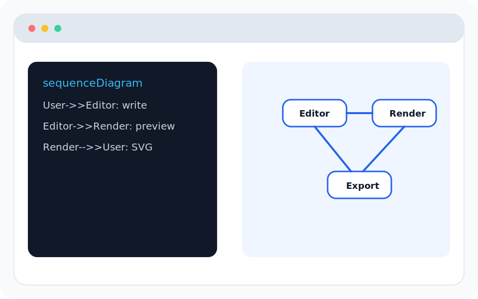
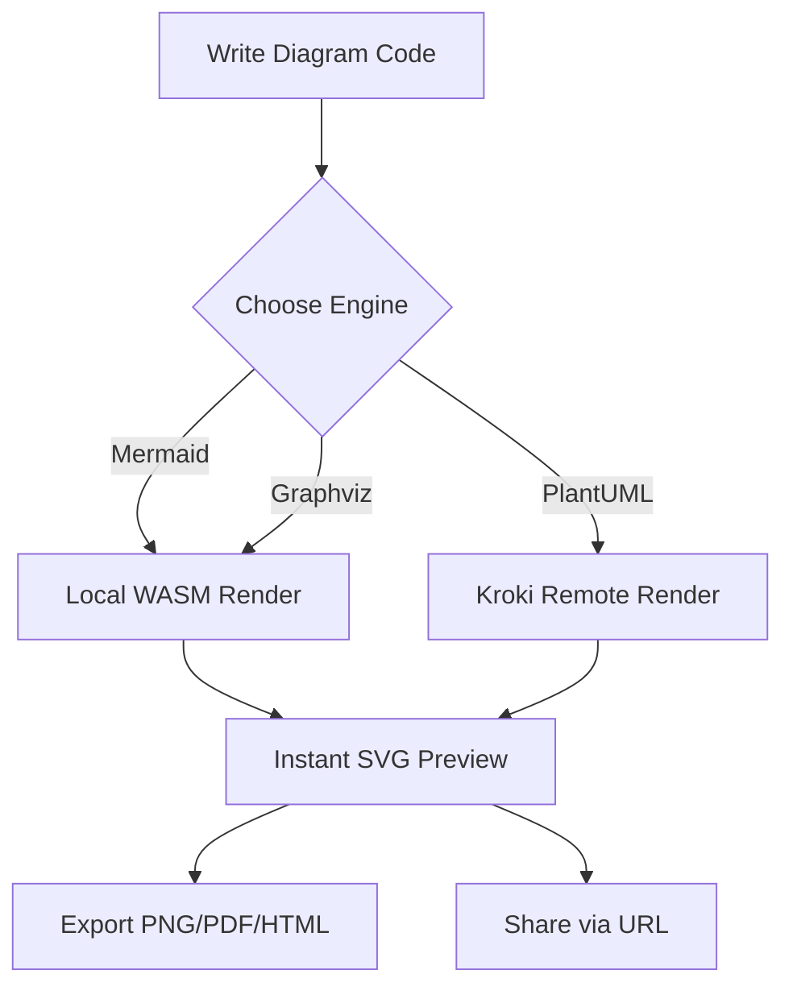
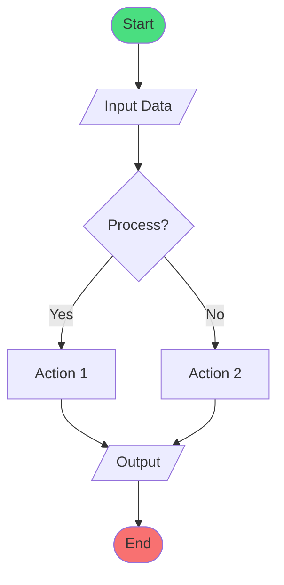

# GraphViewer

<p align="center">
  <strong>🎨 Modern All-in-One Diagram Visualization Tool</strong>
</p>

<p align="center">
  <em>Supporting 16+ diagram engines with hybrid local/remote rendering</em>
</p>

<p align="center">
  
  <a href="https://github.com/LessUp/graph-viewer/blob/master/LICENSE">
    
  </a>
  <a href="https://github.com/LessUp/graph-viewer/actions/workflows/ci.yml">
    
  </a>
  <a href="https://github.com/LessUp/graph-viewer/actions/workflows/pages.yml">
    
  </a>
  <a href="https://github.com/LessUp/graph-viewer/actions/workflows/lighthouse.yml">
    
  </a>
  
  
</p>

<p align="center">
  <b>English</b> | <a href="README.zh-CN.md">简体中文</a>
</p>

<p align="center">
  <a href="https://lessup.github.io/graph-viewer/"><strong>🚀 Live Demo</strong></a> •
  <a href="./docs/en/README.md"><strong>📖 Documentation</strong></a> •
  <a href="./CHANGELOG.md"><strong>📝 Changelog</strong></a>
</p>

---

## Table of Contents

- [Why GraphViewer?](#why-graphviewer)
- [Screenshots](#screenshots)
- [Key Features](#key-features)
- [Quick Start](#quick-start)
- [Supported Engines](#supported-engines)
- [Deployment](#deployment)
- [Development](#development)
- [Architecture](#architecture)
- [Security](#security)
- [Documentation](#documentation)
- [Roadmap](#roadmap)
- [Contributing](#contributing)
- [License](#license)

---

## 🎯 Why GraphViewer?

| Feature             | GraphViewer                       | Traditional Tools             |
| ------------------- | --------------------------------- | ----------------------------- |
| **Rendering Speed** | ⚡ Local WASM (0ms latency)       | ☁️ Always remote              |
| **Privacy**         | 🔒 Code never leaves your browser | ⚠️ Sent to servers            |
| **Engine Support**  | 16+ with unified interface        | Usually 3-5                   |
| **Share Size**      | ~100 bytes (LZ-compressed URL)    | Large files or external links |
| **Offline Support** | ✅ Full offline for local engines | ❌ Requires internet          |

## 📸 Screenshots

<p align="center">
  
</p>

<p align="center">
  <em>Modern interface with live preview, multi-engine support, and one-click export</em>
</p>

### 🎬 Quick Demo



## ✨ Key Features

- **🚀 16+ Diagram Engines**: Mermaid, PlantUML, Graphviz, D2, Vega, Vega-Lite, and more
- **⚡ Hybrid Rendering**: Local WASM (fast, privacy-friendly) + Remote Kroki (broad support)
- **📤 Multiple Exports**: SVG, PNG (2x/4x), PDF, HTML, Markdown, source code
- **🔗 Instant Sharing**: LZ-string compressed URLs for easy diagram sharing
- **💾 Multi-Diagram Workspace**: Local persistence with version history
- **🤖 AI Assistant**: Optional AI-powered code analysis and generation
- **👁️ Real-time Preview**: Debounced live preview with manual render option

## 🚀 Quick Start

### System Requirements

- Node.js >= 20.0.0
- npm >= 10.0.0

### Installation

```bash
# Clone the repository
git clone https://github.com/LessUp/graph-viewer.git
cd graph-viewer

# Install dependencies
npm install

# Start development server
npm run dev
```

Visit [http://localhost:3000](http://localhost:3000).

### Environment Configuration (Optional)

Copy `.env.example` to `.env` to customize:

```bash
cp .env.example .env
```

| Variable                      | Description                                      | Default            |
| ----------------------------- | ------------------------------------------------ | ------------------ |
| `KROKI_BASE_URL`              | Kroki rendering service URL                      | `https://kroki.io` |
| `KROKI_ALLOW_CLIENT_BASE_URL` | Allow client-specified Kroki URL (security risk) | `false`            |
| `PORT`                        | Server port                                      | `3000`             |

### 🎯 30-Second Demo

Paste this Mermaid code into the editor to see GraphViewer in action:



## 🔧 Supported Engines

### Local Rendering (Fast & Private)

| Engine                             | Category | Description                                           |
| ---------------------------------- | -------- | ----------------------------------------------------- |
| [Mermaid](https://mermaid.js.org/) | General  | Flowcharts, sequence diagrams, Gantt charts, and more |
| [Graphviz](https://graphviz.org/)  | Graph    | Graph visualization with multiple layout engines      |

### Remote Rendering (via Kroki)

| Engine                            | Category | Description                    |
| --------------------------------- | -------- | ------------------------------ |
| [PlantUML](https://plantuml.com/) | General  | UML diagrams, mind maps, WBS   |
| [D2](https://d2lang.com/)         | General  | Modern declarative diagramming |

**+ 12 more engines**: See [full list →](docs/en/04-features/02-rendering.md)

## 🚢 Deployment

### Docker (Recommended)

```bash
# Production with public Kroki
docker compose --profile prod up -d

# Production with self-hosted Kroki (better privacy)
docker compose --profile prod --profile kroki up -d
```

| Profile | Purpose                                 |
| ------- | --------------------------------------- |
| `prod`  | Production web server                   |
| `kroki` | Self-hosted Kroki rendering service     |
| `dev`   | Development environment with hot reload |

### GitHub Pages

```bash
npm run build:static
```

See the [GitHub Pages Guide](docs/en/03-deployment/02-github-pages.md) for static hosting and the [Docker Guide](docs/en/03-deployment/01-docker.md) for the full server mode.

## 🛠️ Development

```bash
npm run dev          # Development server on port 3000
npm run build        # Production build (with API routes)
npm run build:static # Static export for GitHub Pages
npm run start        # Production server

# Code Quality
npm run test         # Run unit tests (vitest)
npm run lint         # ESLint check
npm run typecheck    # TypeScript check
npm run format       # Prettier format
```

## 🏗️ Architecture

```
User Input → Editor → Preview Engine
                    ↓
         ┌──────────┴──────────┐
         ↓                     ↓
   Local WASM             Remote Kroki
   (Mermaid,              (All other
    Graphviz)              engines)
         ↓                     ↓
         └──────────┬──────────┘
                    ↓
               SVG/PNG/PDF Output
```

See [RFC-0001: Core Architecture](openspec/specs/architecture/0001-core-architecture.md) for details.

## 🔒 Security

GraphViewer implements multiple security layers:

- SVG sanitization with DOMPurify, strict Mermaid security level
- Input validation, request timeouts, and security headers

See [Security Documentation](docs/en/05-reference/01-configuration.md) for details.

## 📚 Documentation

- [English Documentation](docs/en/README.md)
- [中文文档](docs/zh-CN/README.md)
- [Architecture RFC](openspec/specs/architecture/0001-core-architecture.md)
- [API Reference](docs/en/05-reference/02-api.md)
- [Contributing Guide](CONTRIBUTING.md)

## 🗺️ Roadmap

GraphViewer is in a stable finalization phase. The priority is reliability, documentation accuracy, and deployment clarity rather than adding broad new feature surfaces. See [Product Roadmap](openspec/specs/product/roadmap.md).

## 🤝 Contributing

We welcome contributions! Please read our [Contributing Guide](CONTRIBUTING.md) and [AI Agent Workflow](AGENTS.md) before submitting changes.

1. Fork the repository
2. Create your feature branch (`git checkout -b feature/amazing-feature`)
3. Commit your changes (`git commit -m 'Add amazing feature'`)
4. Push to the branch (`git push origin feature/amazing-feature`)
5. Open a Pull Request

## 📄 License

[MIT License](LICENSE)

## 🙏 Acknowledgments

Built with [Mermaid](https://mermaid.js.org/), [Kroki](https://kroki.io/), [CodeMirror](https://codemirror.net/), [Next.js](https://nextjs.org/), and [Graphviz WASM](https://github.com/hpcc-systems/hpcc-js-wasm).

---

<p align="center">
  Made with ❤️ by the GraphViewer team
</p>
