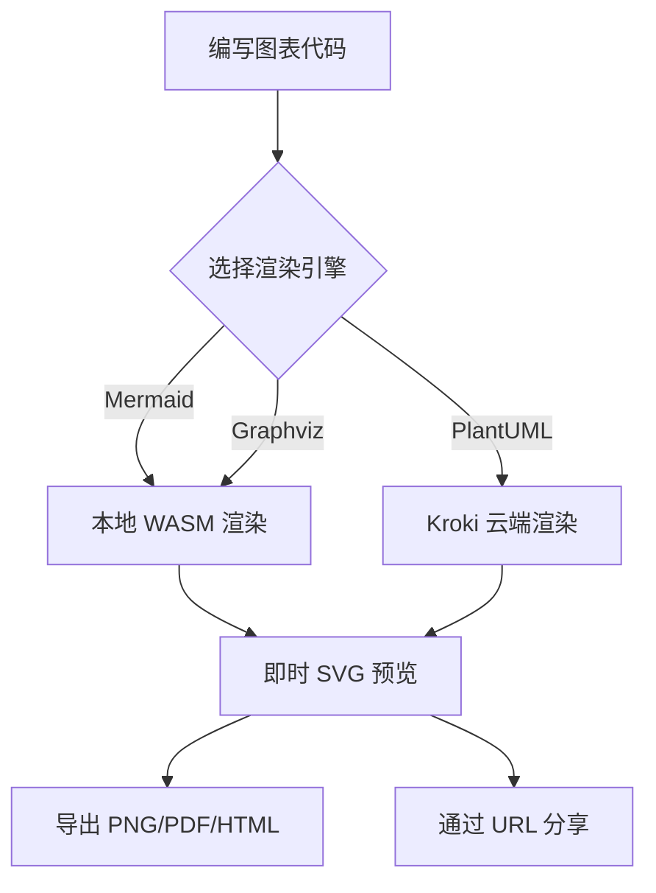
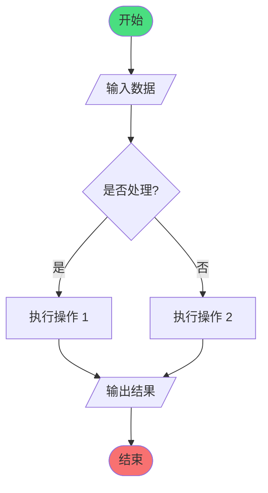

# GraphViewer

<p align="center">
  <strong>🎨 现代化一站式图表可视化工具</strong>
</p>

<p align="center">
  <em>支持 16+ 图表引擎，混合本地/远程渲染</em>
</p>

<p align="center">
  
  <a href="https://github.com/LessUp/graph-viewer/blob/master/LICENSE">
    
  </a>
  <a href="https://github.com/LessUp/graph-viewer/actions/workflows/ci.yml">
    
  </a>
  <a href="https://github.com/LessUp/graph-viewer/actions/workflows/pages.yml">
    
  </a>
  <a href="https://github.com/LessUp/graph-viewer/actions/workflows/lighthouse.yml">
    
  </a>
  
  
</p>

<p align="center">
  <a href="README.md">English</a> | <b>简体中文</b>
</p>

<p align="center">
  <a href="https://lessup.github.io/graph-viewer/"><strong>🚀 在线演示</strong></a> •
  <a href="./docs/zh-CN/README.md"><strong>📖 文档</strong></a> •
  <a href="./CHANGELOG.md"><strong>📝 更新日志</strong></a>
</p>

---

## 目录

- [为什么选择 GraphViewer？](#为什么选择-graphviewer)
- [界面截图](#界面截图)
- [核心特性](#核心特性)
- [快速开始](#快速开始)
- [支持的引擎](#支持的引擎)
- [部署](#部署)
- [开发](#开发)
- [架构](#架构)
- [安全性](#安全性)
- [文档](#文档)
- [路线图](#路线图)
- [贡献](#贡献)
- [许可证](#许可证)

---

## 🎯 为什么选择 GraphViewer？

| 特性         | GraphViewer             | 传统工具         |
| ------------ | ----------------------- | ---------------- |
| **渲染速度** | ⚡ 本地 WASM (0ms 延迟) | ☁️ 始终远程渲染  |
| **隐私安全** | 🔒 代码不会离开浏览器   | ⚠️ 发送至服务器  |
| **引擎支持** | 16+ 引擎，统一界面      | 通常仅 3-5 个    |
| **分享大小** | ~100 字节 (LZ 压缩 URL) | 大文件或外部链接 |
| **离线支持** | ✅ 本地引擎完全离线     | ❌ 需要网络连接  |

## 📸 界面截图

<p align="center">
  
</p>

<p align="center">
  <em>现代化界面，实时预览，多引擎支持，一键导出</em>
</p>

### 🎬 快速演示



## ✨ 核心特性

- **🚀 16+ 图表引擎**: Mermaid, PlantUML, Graphviz, D2, Vega, Vega-Lite 等
- **⚡ 混合渲染**: 本地 WASM (快速、隐私友好) + 远程 Kroki (广泛支持)
- **📤 多格式导出**: SVG、PNG (2x/4x)、PDF、HTML、Markdown、源代码
- **🔗 即时分享**: LZ-string 压缩 URL，轻松分享图表
- **💾 多图表工作区**: 本地持久化存储，支持版本历史
- **🤖 AI 助手**: 可选的 AI 驱动代码分析和生成
- **👁️ 实时预览**: 带防抖的实时预览，支持手动渲染

## 🚀 快速开始

### 系统要求

- Node.js >= 20.0.0
- npm >= 10.0.0

### 安装

```bash
# 克隆仓库
git clone https://github.com/LessUp/graph-viewer.git
cd graph-viewer

# 安装依赖
npm install

# 启动开发服务器
npm run dev
```

访问 [http://localhost:3000](http://localhost:3000)。

### 环境配置（可选）

复制 `.env.example` 为 `.env` 进行自定义配置：

```bash
cp .env.example .env
```

| 变量                          | 说明                                  | 默认值             |
| ----------------------------- | ------------------------------------- | ------------------ |
| `KROKI_BASE_URL`              | Kroki 渲染服务地址                    | `https://kroki.io` |
| `KROKI_ALLOW_CLIENT_BASE_URL` | 允许客户端指定 Kroki 地址（安全风险） | `false`            |
| `PORT`                        | 服务端口                              | `3000`             |

### 🎯 30 秒快速体验

将以下 Mermaid 代码粘贴到编辑器中，立即体验 GraphViewer：



## 🔧 支持的引擎

### 本地渲染（快速且私密）

| 引擎                               | 类别 | 说明                     |
| ---------------------------------- | ---- | ------------------------ |
| [Mermaid](https://mermaid.js.org/) | 通用 | 流程图、时序图、甘特图等 |
| [Graphviz](https://graphviz.org/)  | 图   | 多种布局引擎的图可视化   |

### 远程渲染（通过 Kroki）

| 引擎                              | 类别 | 说明                           |
| --------------------------------- | ---- | ------------------------------ |
| [PlantUML](https://plantuml.com/) | 通用 | UML 图、思维导图、工作分解结构 |
| [D2](https://d2lang.com/)         | 通用 | 现代声明式图表                 |

**+ 12 个更多引擎**：查看[完整列表 →](docs/zh-CN/04-features/02-rendering.md)

## 🚢 部署

### Docker (推荐)

```bash
# 生产环境 + 公共 Kroki
docker compose --profile prod up -d

# 生产环境 + 自建 Kroki（更好的隐私保护）
docker compose --profile prod --profile kroki up -d
```

| Profile | 用途                |
| ------- | ------------------- |
| `prod`  | 生产 Web 服务器     |
| `kroki` | 自建 Kroki 渲染服务 |
| `dev`   | 开发环境（热重载）  |

### GitHub Pages

```bash
npm run build:static
```

静态托管详见 [GitHub Pages 指南](docs/zh-CN/03-deployment/02-github-pages.md)，完整服务模式详见 [Docker 指南](docs/zh-CN/03-deployment/01-docker.md)。

## 🛠️ 开发

```bash
npm run dev          # 开发服务器 (端口 3000)
npm run build        # 生产构建 (含 API 路由)
npm run build:static # 静态导出 (用于 GitHub Pages)
npm run start        # 生产服务器

# 代码质量
npm run test         # 运行单元测试 (vitest)
npm run lint         # ESLint 检查
npm run typecheck    # TypeScript 检查
npm run format       # Prettier 格式化
```

## 🏗️ 架构

```
用户输入 → 编辑器 → 预览引擎
                    ↓
         ┌──────────┴──────────┐
         ↓                     ↓
   本地 WASM             远程 Kroki
   (Mermaid,              (其他所有
    Graphviz)              引擎)
         ↓                     ↓
         └──────────┬──────────┘
                    ↓
               SVG/PNG/PDF 输出
```

详细信息请参见 [RFC-0001: 核心架构](openspec/specs/architecture/0001-core-architecture.md)。

## 🔒 安全性

GraphViewer 实现多层安全防护：

- 使用 DOMPurify SVG 净化，Mermaid 严格安全级别
- 输入验证、请求超时和安全响应头

详见 [安全配置文档](docs/zh-CN/05-reference/01-configuration.md)。

## 📚 文档

- [English Documentation](docs/en/README.md)
- [中文文档](docs/zh-CN/README.md)
- [架构 RFC](openspec/specs/architecture/0001-core-architecture.md)
- [API 文档](docs/zh-CN/05-reference/02-api.md)
- [贡献指南](CONTRIBUTING.md)

## 🗺️ 路线图

GraphViewer 当前处于稳定收尾阶段。优先级是可靠性、文档准确性和部署清晰度，而不是继续扩张大功能面。详见 [产品路线图](openspec/specs/product/roadmap.md)。

## 🤝 贡献

我们欢迎贡献！请阅读[贡献指南](CONTRIBUTING.md)和[AI Agent 工作流](AGENTS.md)后再提交更改。

1. Fork 本仓库
2. 创建功能分支 (`git checkout -b feature/amazing-feature`)
3. 提交更改 (`git commit -m '添加新功能'`)
4. 推送到分支 (`git push origin feature/amazing-feature`)
5. 创建 Pull Request

## 📄 许可证

[MIT License](LICENSE)

## 🙏 致谢

基于 [Mermaid](https://mermaid.js.org/)、[Kroki](https://kroki.io/)、[CodeMirror](https://codemirror.net/)、[Next.js](https://nextjs.org/) 和 [Graphviz WASM](https://github.com/hpcc-systems/hpcc-js-wasm) 构建。

---

<p align="center">
  用 ❤️ 打造 by GraphViewer 团队
</p>
