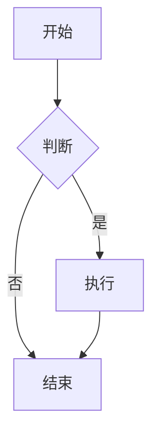
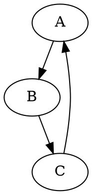
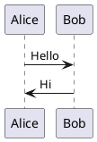

# 导出功能测试指南

## 快速测试步骤

### 1. 启动开发服务器

```bash
npm install
npm run dev
```

访问 http://localhost:3000

### 2. 测试 SVG 导出

1. 在编辑器中输入或选择一个示例图表
2. 等待图表渲染完成
3. 点击右上角的"导出"按钮
4. 选择"SVG 矢量图"
5. 验证下载的 SVG 文件可以正常打开和显示

**预期结果：**
- ✅ SVG 文件可以在浏览器中打开
- ✅ 所有样式和颜色正确显示
- ✅ 文字清晰可读
- ✅ 图表结构完整

### 3. 测试 PNG 导出（标准质量）

1. 点击"导出" → "PNG 高清 (2x)"
2. 验证下载的 PNG 文件

**预期结果：**
- ✅ PNG 图片清晰，无明显锯齿
- ✅ 颜色准确
- ✅ 背景为白色
- ✅ 文件大小合理（通常 < 5MB）

### 4. 测试 PNG 导出（超清质量）

1. 点击"导出" → "PNG 超清 (4x)"
2. 验证下载的 PNG 文件

**预期结果：**
- ✅ PNG 图片非常清晰，适合打印
- ✅ 文件大小较大但可接受
- ✅ 细节保留完整

### 5. 测试复制到剪贴板

1. 点击"导出" → "复制图片到剪贴板"
2. 打开任意图片编辑器或文档编辑器
3. 粘贴（Ctrl+V 或 Cmd+V）

**预期结果：**
- ✅ 显示"已复制"提示
- ✅ 可以成功粘贴到其他应用
- ✅ 粘贴的图片质量良好

### 6. 测试不同图表类型

测试以下图表引擎的导出：

#### Mermaid


#### Graphviz


#### PlantUML


### 7. 测试边界情况

#### 大型图表
- 创建包含 50+ 节点的复杂图表
- 测试导出是否成功
- 验证导出时间是否合理（< 10秒）

#### 包含特殊字符
- 测试包含中文、emoji、特殊符号的图表
- 验证导出后字符显示正确

#### 自定义样式
- 测试包含自定义颜色、字体的图表
- 验证样式是否保留

## 常见问题排查

### 问题 1：导出的 PNG 模糊

**可能原因：**
- 缩放倍数太低
- 浏览器缩放设置不是 100%

**解决方案：**
- 使用 4x 超清导出
- 重置浏览器缩放到 100%

### 问题 2：导出失败或报错

**可能原因：**
- SVG 内容过大
- 浏览器内存不足
- 网络问题（如果使用远程渲染）

**解决方案：**
- 简化图表内容
- 关闭其他标签页释放内存
- 检查网络连接

### 问题 3：样式丢失

**可能原因：**
- 使用了外部 CSS
- 浏览器兼容性问题

**解决方案：**
- 已在新版本中修复
- 确保使用最新代码

### 问题 4：复制到剪贴板失败

**可能原因：**
- 浏览器不支持 Clipboard API
- 权限被拒绝

**解决方案：**
- 使用现代浏览器（Chrome 90+, Firefox 88+）
- 允许剪贴板权限
- 使用 HTTPS 或 localhost

## 性能基准

### 标准图表（< 100 节点）
- SVG 导出：< 100ms
- PNG 2x 导出：< 2s
- PNG 4x 导出：< 5s

### 大型图表（100-500 节点）
- SVG 导出：< 500ms
- PNG 2x 导出：< 5s
- PNG 4x 导出：< 15s

### 超大图表（> 500 节点）
- 建议使用 SVG 格式
- PNG 导出可能需要 30s+

## 浏览器兼容性测试清单

- [ ] Chrome/Edge (Chromium)
- [ ] Firefox
- [ ] Safari
- [ ] 移动端浏览器

## 自动化测试（未来）

```javascript
// 示例测试代码
describe('Export Functions', () => {
  it('should export SVG correctly', async () => {
    const svg = '<svg>...</svg>';
    await exportSvg(svg, 'test');
    // 验证文件下载
  });

  it('should export PNG with correct dimensions', async () => {
    const svg = '<svg width="100" height="100">...</svg>';
    const canvas = await svgToCanvas(svg, { scale: 2 });
    expect(canvas.width).toBe(200);
    expect(canvas.height).toBe(200);
  });
});
```

## 反馈和报告

如果发现问题，请提供：
1. 浏览器版本
2. 图表类型和代码
3. 错误信息截图
4. 控制台日志
