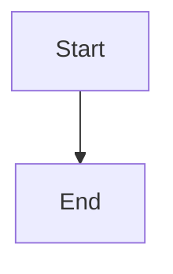

# Export Capabilities

GraphViewer supports multiple export formats for sharing and publishing diagrams.

## Supported Formats

| Format   | Extension             | Use Case                       |
| -------- | --------------------- | ------------------------------ |
| SVG      | `.svg`                | Vector graphics, web embedding |
| PNG 2x   | `.png`                | High-quality screenshots       |
| PNG 4x   | `.png`                | Print-ready, presentations     |
| HTML     | `.html`               | Standalone web pages           |
| Markdown | `.md`                 | Documentation, GitHub          |
| Source   | `.mmd`, `.puml`, etc. | Original code                  |

## Using Export

### Export Button

1. Render your diagram (SVG preview required)
2. Click the export button in the preview toolbar
3. Select desired format

### Clipboard Export

- **Copy PNG**: Copies rendered image to system clipboard
- **Copy Code**: Copies diagram source code

## Format Details

### SVG Export

**Features:**

- Scalable vector graphics
- Style inlining for portability
- Namespace preservation
- Embedded fonts (where possible)

**Best For:**

- Further editing in vector tools (Illustrator, Figma)
- Web embedding with CSS control
- Archival storage

**Implementation:**

```typescript
// lib/exportUtils.ts
export function exportSvg(svgContent: string, filename: string): void;
```

### PNG Export

**Options:**

- **2x (HD)**: Standard high quality
- **4x (Ultra HD)**: Maximum quality for print

**Rendering Strategy:**

1. **Primary**: html2canvas for complex SVG handling
2. **Fallback**: Native Image + Canvas API

**Configuration:**

```typescript
// Quality settings
const quality = 0.95; // JPEG quality
const imageSmoothing = 'high'; // Interpolation
```

**Best For:**

- Social media sharing
- Email attachments
- Documents and presentations

### HTML Export

**Features:**

- Self-contained HTML file
- Embedded SVG
- Responsive viewport
- No external dependencies

**Template Structure:**

```html
<!DOCTYPE html>
<html>
  <head>
    <title>Diagram</title>
    <style>
      /* Embedded styles */
    </style>
  </head>
  <body>
    <div class="diagram-container">
      <!-- Embedded SVG -->
    </div>
  </body>
</html>
```

**Best For:**

- Sharing single diagrams
- Embedding in web pages
- Archive reference

### Markdown Export

**Format:**

````markdown
# Diagram Title

Generated by GraphViewer


````

**Language Mapping:**

| Engine   | Markdown Language |
| -------- | ----------------- |
| Mermaid  | `mermaid`         |
| PlantUML | `plantuml`        |
| Graphviz | `dot`             |
| D2       | `d2`              |

**Best For:**

- GitHub/GitLab documentation
- Knowledge bases
- Version-controlled docs

### Source Code Export

**Extension Mapping:**

| Engine    | Extension  |
| --------- | ---------- |
| Mermaid   | `.mmd`     |
| PlantUML  | `.puml`    |
| Graphviz  | `.dot`     |
| D2        | `.d2`      |
| Vega      | `.vg.json` |
| Vega-Lite | `.vl.json` |

**Best For:**

- Version control
- Code review
- Editing in external tools

## Implementation Details

### SVG Preprocessing

Before export, SVG undergoes preprocessing:

```typescript
function preprocessSvg(svg: string): string {
  // 1. Ensure XML namespace
  // 2. Inline computed styles
  // 3. Handle CDATA in style tags
  // 4. Extract dimensions from viewBox
  // 5. Add padding if needed
}
```

### PNG Generation

**Dual Strategy:**

```typescript
async function exportPng(svg: string, scale: number): Promise<Blob> {
  try {
    // Primary: html2canvas for quality
    return await html2canvasMethod(svg, scale);
  } catch {
    // Fallback: native canvas
    return await nativeCanvasMethod(svg, scale);
  }
}
```

**Canvas Configuration:**

```typescript
const canvas = document.createElement('canvas');
canvas.width = width * scale;
canvas.height = height * scale;

const ctx = canvas.getContext('2d');
ctx.imageSmoothingEnabled = true;
ctx.imageSmoothingQuality = 'high';
```

### Clipboard API

```typescript
async function copyPngToClipboard(svg: string): Promise<void> {
  const blob = await svgToPngBlob(svg);
  await navigator.clipboard.write([new ClipboardItem({ 'image/png': blob })]);
}
```

**Requirements:**

- Secure context (HTTPS or localhost)
- Browser support (Chrome 76+, Firefox 63+, Safari 13.1+)
- User permission

## Known Limitations

### SVG Complexity

Very large or complex SVGs may:

- Exceed canvas memory limits
- Take longer to process
- Require more RAM

### Font Rendering

Custom fonts in SVG may not render correctly in PNG:

- System fonts work best
- Web fonts may need `@font-face` inlining
- Consider converting text to paths

### External Resources

SVGs with external references (images, fonts):

- May not display correctly
- Consider embedding resources as data URIs

### Browser Compatibility

| Feature       | Chrome | Firefox | Safari   | Edge   |
| ------------- | ------ | ------- | -------- | ------ |
| SVG Export    | ✅     | ✅      | ✅       | ✅     |
| PNG Export    | ✅     | ✅      | ✅       | ✅     |
| Clipboard PNG | ✅ 76+ | ✅ 63+  | ✅ 13.1+ | ✅ 79+ |
| HTML Export   | ✅     | ✅      | ✅       | ✅     |

## Manual Verification

Test these scenarios after changes:

- [ ] Mermaid → SVG → Open in browser
- [ ] Mermaid → PNG 2x → Check clarity
- [ ] Mermaid → PNG 4x → Check file size
- [ ] Graphviz → SVG → Check style
- [ ] PlantUML → PNG → Verify colors
- [ ] Export → HTML → Open standalone
- [ ] Export → Markdown → Preview on GitHub
- [ ] Copy PNG → Paste in Slack/Email
- [ ] Chinese characters render correctly
- [ ] Emoji display correctly

## Future Enhancements

Planned improvements:

- PDF file export (currently only preview)
- Animation export (GIF/MP4)
- Batch export for workspace
- Export templates/customization
