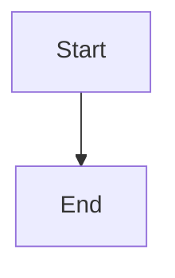

# 导出功能

GraphViewer 支持多种导出格式，用于分享和发布图表。

## 支持的格式

| 格式 | 扩展名 | 用途 |
|------|--------|------|
| SVG | `.svg` | 矢量图，网页嵌入 |
| PNG 2x | `.png` | 高质量截图 |
| PNG 4x | `.png` | 打印就绪，演示文稿 |
| HTML | `.html` | 独立网页 |
| Markdown | `.md` | 文档，GitHub |
| 源码 | `.mmd`, `.puml` 等 | 原始代码 |

## 使用导出

### 导出按钮

1. 渲染您的图表（需要 SVG 预览）
2. 点击预览工具栏中的导出按钮
3. 选择所需格式

### 剪贴板导出

- **复制 PNG**：将渲染的图片复制到系统剪贴板
- **复制代码**：复制图表源代码

## 格式详情

### SVG 导出

**特性：**
- 可缩放矢量图
- 样式内联便于移植
- 命名空间保留
- 嵌入字体（尽可能）

**最适合：**
- 在矢量工具中进一步编辑（Illustrator、Figma）
- 带 CSS 控制的网页嵌入
- 存档存储

**实现：**
```typescript
// lib/exportUtils.ts
export function exportSvg(svgContent: string, filename: string): void
```

### PNG 导出

**选项：**
- **2x (HD)**：标准高质量
- **4x (超清)**：打印最大质量

**渲染策略：**
1. **主要**：html2canvas 处理复杂 SVG
2. **回退**：原生 Image + Canvas API

**配置：**
```typescript
// 质量设置
const quality = 0.95;           // JPEG 质量
const imageSmoothing = 'high';  // 插值
```

**最适合：**
- 社交媒体分享
- 邮件附件
- 文档和演示文稿

### HTML 导出

**特性：**
- 自包含 HTML 文件
- 嵌入 SVG
- 响应式视口
- 无外部依赖

**模板结构：**
```html
<!DOCTYPE html>
<html>
<head>
  <title>图表</title>
  <style>/* 嵌入样式 */</style>
</head>
<body>
  <div class="diagram-container">
    <!-- 嵌入 SVG -->
  </div>
</body>
</html>
```

**最适合：**
- 分享单个图表
- 嵌入网页
- 存档参考

### Markdown 导出

**格式：**

````markdown
# 图表标题

Generated by GraphViewer


````

**语言映射：**

| 引擎 | Markdown 语言 |
|------|---------------|
| Mermaid | `mermaid` |
| PlantUML | `plantuml` |
| Graphviz | `dot` |
| D2 | `d2` |

**最适合：**
- GitHub/GitLab 文档
- 知识库
- 版本控制文档

### 源码导出

**扩展名映射：**

| 引擎 | 扩展名 |
|------|--------|
| Mermaid | `.mmd` |
| PlantUML | `.puml` |
| Graphviz | `.dot` |
| D2 | `.d2` |
| Vega | `.vg.json` |
| Vega-Lite | `.vl.json` |

**最适合：**
- 版本控制
- 代码审查
- 在外部工具中编辑

## 实现细节

### SVG 预处理

导出前，SVG 经过预处理：

```typescript
function preprocessSvg(svg: string): string {
  // 1. 确保 XML 命名空间
  // 2. 内联计算样式
  // 3. 处理样式标签中的 CDATA
  // 4. 从 viewBox 提取尺寸
  // 5. 添加内边距（如需要）
}
```

### PNG 生成

**双重策略：**

```typescript
async function exportPng(svg: string, scale: number): Promise<Blob> {
  try {
    // 主要：html2canvas 保证质量
    return await html2canvasMethod(svg, scale);
  } catch {
    // 回退：原生 canvas
    return await nativeCanvasMethod(svg, scale);
  }
}
```

**Canvas 配置：**

```typescript
const canvas = document.createElement('canvas');
canvas.width = width * scale;
canvas.height = height * scale;

const ctx = canvas.getContext('2d');
ctx.imageSmoothingEnabled = true;
ctx.imageSmoothingQuality = 'high';
```

### 剪贴板 API

```typescript
async function copyPngToClipboard(svg: string): Promise<void> {
  const blob = await svgToPngBlob(svg);
  await navigator.clipboard.write([
    new ClipboardItem({ 'image/png': blob })
  ]);
}
```

**要求：**
- 安全上下文（HTTPS 或 localhost）
- 浏览器支持（Chrome 76+、Firefox 63+、Safari 13.1+）
- 用户权限

## 已知限制

### SVG 复杂度

非常大或复杂的 SVG 可能：
- 超出 canvas 内存限制
- 处理时间更长
- 需要更多 RAM

### 字体渲染

SVG 中的自定义字体在 PNG 中可能无法正确渲染：
- 系统字体效果最好
- Web 字体可能需要内联 `@font-face`
- 考虑将文本转换为路径

### 外部资源

包含外部引用的 SVG（图片、字体）：
- 可能无法正确显示
- 考虑将资源嵌入为 data URI

### 浏览器兼容性

| 特性 | Chrome | Firefox | Safari | Edge |
|------|--------|---------|--------|------|
| SVG 导出 | ✅ | ✅ | ✅ | ✅ |
| PNG 导出 | ✅ | ✅ | ✅ | ✅ |
| 剪贴板 PNG | ✅ 76+ | ✅ 63+ | ✅ 13.1+ | ✅ 79+ |
| HTML 导出 | ✅ | ✅ | ✅ | ✅ |

## 手动验证

更改后测试这些场景：

- [ ] Mermaid → SVG → 在浏览器中打开
- [ ] Mermaid → PNG 2x → 检查清晰度
- [ ] Mermaid → PNG 4x → 检查文件大小
- [ ] Graphviz → SVG → 检查样式
- [ ] PlantUML → PNG → 验证颜色
- [ ] 导出 → HTML → 独立打开
- [ ] 导出 → Markdown → 在 GitHub 上预览
- [ ] 复制 PNG → 粘贴到 Slack/邮件中
- [ ] 中文字符正确渲染
- [ ] Emoji 正确显示

## 未来增强

计划改进：
- PDF 文件导出（目前仅预览）
- 动画导出（GIF/MP4）
- 工作区批量导出
- 导出模板/自定义
